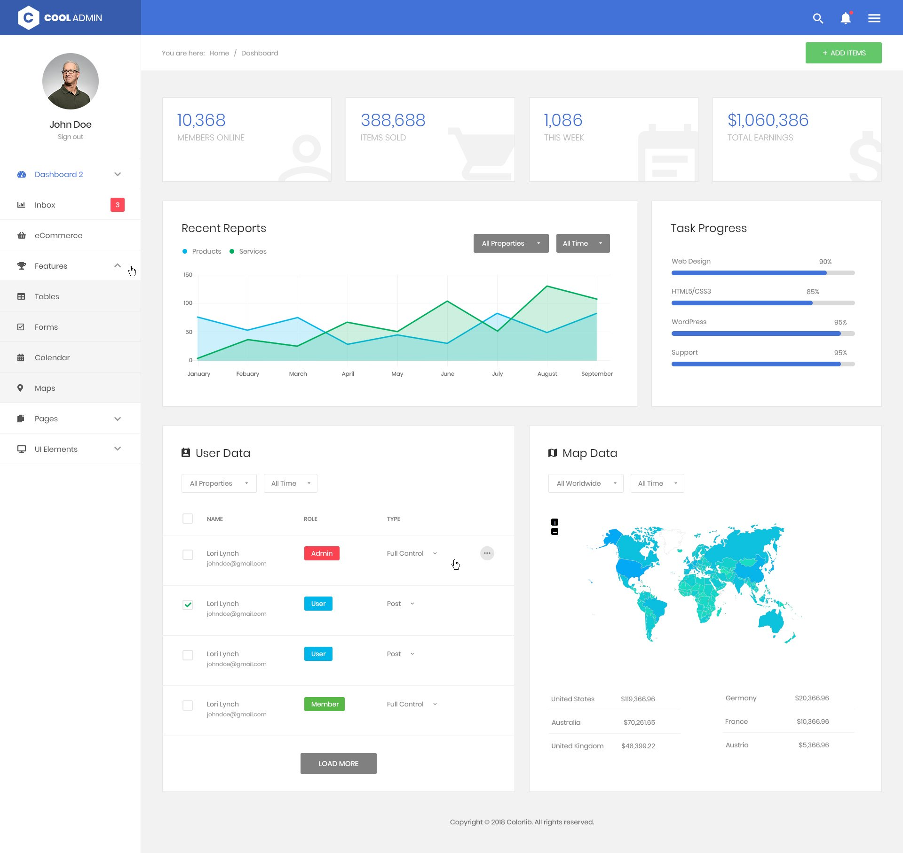

<<<<<<< HEAD
CoolAdmin Bootstrap 4.1 Admin Dashboard Template
================================================

**CoolAdmin** is a responsive Bootstrap 4.1 admin template. It provides you with
a collection of ready to use code snippets and utilities, custom pages, loads of
charts, 4 different dashboard variations, a collection of applications and some
useful widgets. Preview of this awesome admin template available here:
https://colorlib.com/polygon/cooladmin/index.html

Preview
=======

### Screenshot

CoolAdmin admin dashboard template preview

### Demo Site: [[Here]](https://colorlib.com/polygon/cooladmin/index.html)

### TOC

-   [Built With](#built-with)

-   [Changelog](#changelog)

-   [Authors](#authors)

-   [License](#license)

### Built With

-   [Accordion.JS](https://github.com/awps/Accordion.JS)

-   [animsition](http://blivesta.github.io/animsition)

-   [bootstrap-progressbar](https://github.com/minddust/bootstrap-progressbar)

-   [Bootstrap](http://getbootstrap.com/)

-   [Chart.js](http://www.chartjs.org/)

-   [Counter-Up](https://github.com/bfintal/Counter-Up)

-   [CSS Hamburgers](https://github.com/jonsuh/hamburgers)

-   [Full Calendar](https://fullcalendar.io)

-   [Fontawesome](http://fontawesome.io/)

-   [jquery-circle-progress](http://kottenator.github.io/jquery-circle-progress/)

-   [jQuery](https://jquery.com/)

-   [Date picker](https://www.jqueryscript.net/time-clock/Date-Time-Picker-Bootstrap-4.html)

-   [JQVMap](https://jqvmap.com/)

-   [Lightbox2](https://github.com/lokesh/lightbox2)

-   [Material Design
    Icons](https://github.com/Templarian/MaterialDesign-Webfont)

-   [perfect-scrollbar](https://github.com/utatti/perfect-scrollbar)

-   [ProgressBar.js](https://github.com/kimmobrunfeldt/progressbar.js)

-   [Select2](https://github.com/select2/select2)

-   [Slick](http://kenwheeler.github.io/slick/)

-   [Sweetalwer](https://github.com/sweetalert2/sweetalert2)

-   [The Final Countdown for jQuery](http://hilios.github.io/jQuery.countdown/)

-   [WOW](https://github.com/matthieua/WOW)

### Changelog

#### V 1.0.0

Initial Release \#\#\# Authors [Colorlib](https://colorlib.com)

### More info

-   [Bootstrap
    dashboards](https://colorlib.com/wp/free-bootstrap-admin-dashboard-templates/)

-   [Angular dashboards](https://colorlib.com/wp/angularjs-admin-templates/)

-   [Free Admin
    Dashboards](https://colorlib.com/wp/free-html5-admin-dashboard-templates/)

-   [Website Templates](https://colorlib.com/wp/templates/)

-   [Free WordPress Themes](https://colorlib.com/wp/free-wordpress-themes/)

### License

CoolAdmin is licensed under The MIT License (MIT). Which means that you can use,
copy, modify, merge, publish, distribute, sublicense, and/or sell copies of the
final products. But you always need to state that Colorlib is the original
author of this template.
=======
# Documentation du Projet

## Fonctionnalités

### Authentification Utilisateur
- Fonctionnalités de connexion, déconnexion et inscription pour garantir un accès sécurisé.

### Pages d'Erreur
- Pages personnalisées pour :
  - **Accès non autorisé** (401)
  - **Page introuvable** (404)
  - **Erreur serveur** (500)

### Gestion des Joueurs
- Permet l'ajout, la suppression et la gestion des joueurs via `AddPlayer.php` et `DeletePlayer.php`.

### Gestion des Membres
- Facilite l'ajout et la suppression de membres via `AddMembre.php` et `DeleteMembre.php`.

### Statistiques et Graphiques
- Affiche des analyses et des statistiques via `charts.php` et `fetchStat.php`.

### Templates Réutilisables
- Conception modulaire avec des templates statiques et des thèmes clairs.

## Langages Utilisés

- **HTML**
- **CSS**
- **Bootstrap**
- **JavaScript**
- **PHP**

## Tâches et Responsabilités

| **Page**                 | **Responsable**       |
|---------------------------|-----------------------|
| **Administration (Dashboard)** | Azzedine Rih         |
| **Gestion des Joueurs**        | Aymane Ed-dahhak     |
| **Gestion des Entraîneurs**    | Aymane Abbad         |
| **Page d'Accueil**             | Oussama Outchente    |
>>>>>>> fb1d3916757e51253a73e398aeefcbc495b4175a
